# Smart Wheelchair — 多模态自主导航轮椅上位机系统

> MindVoice Smart Wheelchair: brain-controlled, voice-interactive, self-navigating wheelchair software platform — three heterogeneous input modalities, one unified safety execution layer.
>
> 2026 英特尔杯参赛作品 ｜ ROS 2 Humble + PyQt5 + OpenVINO ｜ 运行于 Intel Core Ultra 5 DK2500 单板


---

## 目录

- [项目定位](#项目定位)
- [实物展示](#实物展示)
- [系统概览与分层架构](#系统概览与分层架构)
- [脑控链路](#脑控链路)
- [离线语音链路](#离线语音链路)
- [导航子系统](#导航子系统)
- [安全体系](#安全体系)
- [端侧AI部署](#端侧ai部署)
- [硬件清单](#硬件清单)
- [快速开始](#快速开始)
- [模型权重下载](#模型权重下载)
- [集成测试](#集成测试)
- [电控层说明](#电控层说明)
- [目录结构](#目录结构)
- [Roadmap](#roadmap)
- [License](#license)

---

## 项目定位

这是一套面向残障人群的多模态自主导航轮椅上位机软件系统。针对重度运动障碍用户"想动不能动、想说说不清、想出门出不去"的现实困境，系统提供三种互补的控制与交互模态：脑电控制（想）、语音陪伴（说）、自主导航（行）。

工程上的核心命题是：三条异构输入链路的可靠性、实时性、故障模式完全不同，如何在同一辆轮椅上共存而不互相伤害。本系统的答案是分层架构——三条链路全部汇聚到单一安全执行层，由固定优先级仲裁、心跳失效保护与三道安全防线兜底，任何单点故障都不传导至电机。

```text
EEG 脑控 ──────┐
               │   固定优先级仲裁 + 3秒心跳失效保护
离线语音 ──────┼──────────────▶ chassis_serial_node ──▶ UART 100Hz ──▶ DJI A板 ──▶ 电机
               │   safety_chain 20Hz 直读雷达（0.3m急停）
Nav2 自主导航 ──┘
```

---

## 实物展示

| 整车正面 | 整车背面 |
|---|---|
| 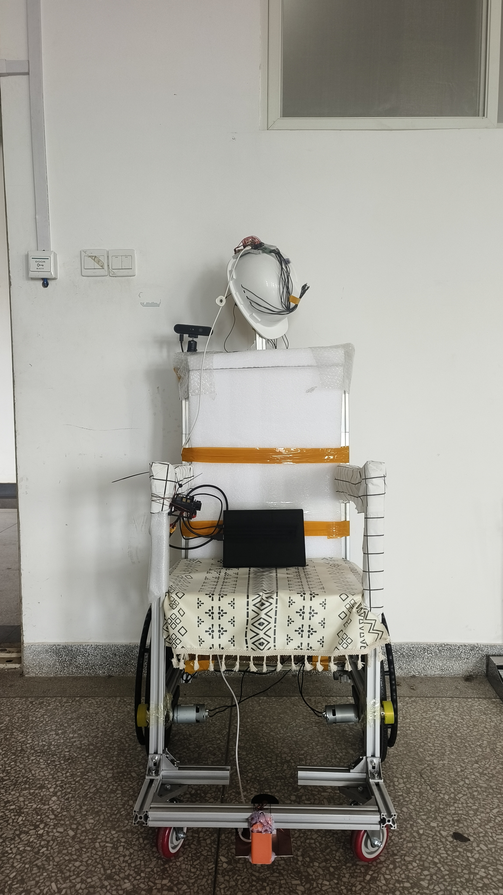 | 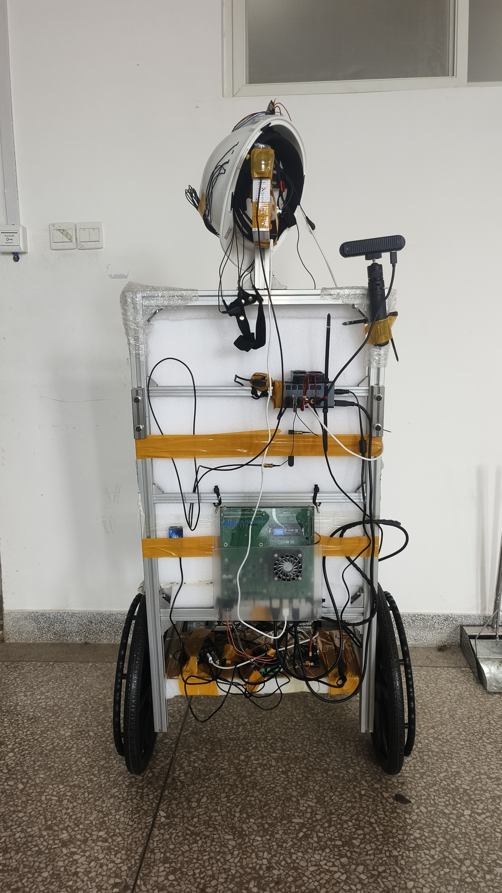 |

自制前额脑电采集帽（ADS1299 八通道，前额四电极使用）：

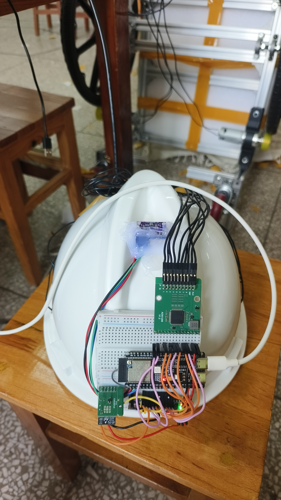

---

## 系统概览与分层架构

本系统是多模态自主导航轮椅的上位机软件平台，2026年英特尔杯参赛作品。系统接收三条独立输入链路——脑电信号、语音指令和地图导航指令——通过分层仲裁机制汇聚到单一安全执行层，最终通过串口协议控制底盘运动。核心设计主线是"三模态输入、单一安全执行"：脑控提供自由操控能力，语音提供自然交互体验，自主导航提供点到点路径规划，三者互斥切换且共享统一安全边界。

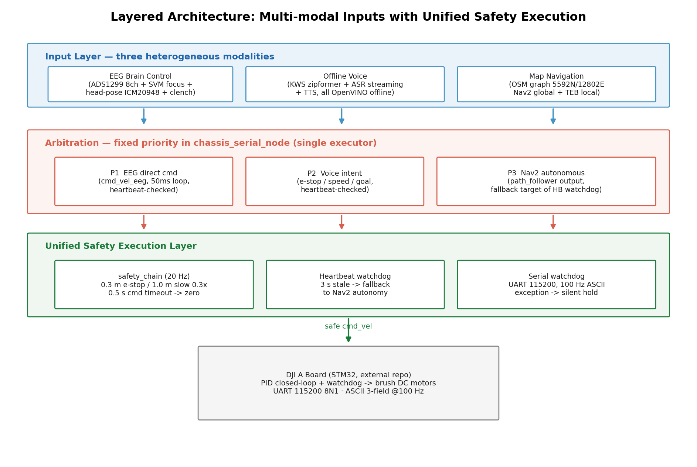

图1展示了系统的四层架构。硬件抽象层直接对接传感器和执行器，感知层融合多路数据并输出统一障碍物表示，决策层运行路径规划和行为仲裁，应用层提供人机交互界面。关键洞察在于：这种分层不是简单的模块堆叠，而是为了解决异构输入模式之间的本质冲突。脑控信号是用户直接的运动意图，自由且实时；自主导航是系统计算出的受约束路径，必须考虑避障和平滑性。如果允许两者直接竞争底盘控制权，会产生不安全的行为叠加。因此必须有一个明确的仲裁层，根据上下文决定谁拥有执行权。

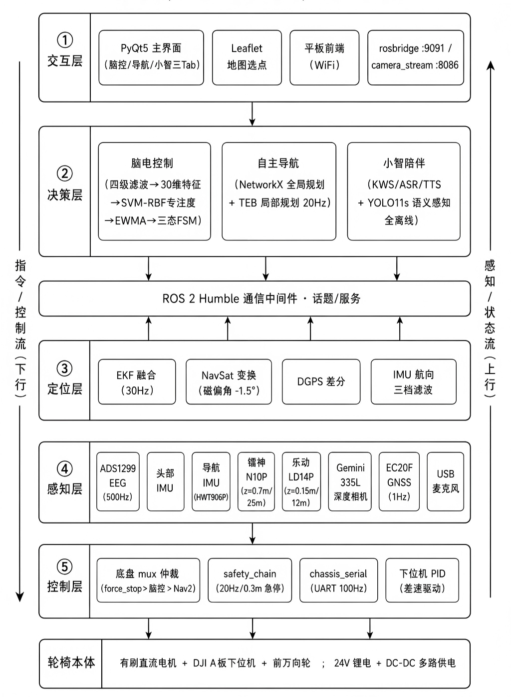

图2展示了完整的系统拓扑。中心是ROS2通信总线，左侧是三模态输入源，右侧是执行机构和反馈回路。该图清晰呈现了系统的"漏斗"结构：多个输入源逐层收敛，最终通过单一的串口连接送达底盘。图中的箭头方向也说明了信息流向：自下而上的传感器数据汇聚成环境认知，自上而下的决策意图逐步细化为执行指令。特别值得注意的是图中标注的"心跳失效保护"和"三道安全防线"，这是整个架构的安全冗余设计，将在§5详细阐述。

## 核心节点清单

系统由16个ROS2节点协同工作，每个节点承担单一职责并通过DDS总线通信。下表列出了所有节点及其所属包和核心功能：

| 节点名 | 所属包 | 职责描述 |
|--------|--------|----------|
| n10p_python_driver | rtk_perception | 驱动镝数N10P激光雷达，发布原始扫描数据 |
| ldlidar_publisher | ldlidar | 驱动乐动LD14P激光雷达，发布原始扫描数据 |
| orbbec_camera | orbbec_camera | 驱动Orbbec Gemini 330深度相机，发布彩色和深度图像 |
| camera_detect_node | rtk_perception | 运行YOLO目标检测，发布边界框和类别 |
| depthimage_to_laserscan_gemini | depthimage_to_laserscan | 将深度图像转换为2D激光扫描数据 |
| fusion_scan_node | rtk_perception | 融合三路激光扫描数据，供RViz显示 |
| networkx_planner | rtk_planner | 基于OSM路网计算全局路径，发布/rtk_global_plan |
| path_to_baselink_node | rtk_perception | 将全局路径转换到机器人坐标系，发布/rtk_nav_path |
| controller_server | nav2_controller | 运行TEB局部规划器，发布/cmd_vel |
| path_feeder_node | rtk_perception | 桥接路径规划与Nav2，管理导航生命周期 |
| chassis_serial_node | rtk_perception | 仲裁多路速度指令，通过串口驱动底盘 |
| voice_node | wheelchair_app | 运行KWS和ASR，发布语音识别结果 |
| tts_node | ladar_ai | 执行文本转语音，通过扬声器播报 |
| safety_chain_node | rtk_perception | 监控指令健康状态，实现心跳失效保护 |
| teb_debug_node | rtk_perception | 发布TEB调试可视化标记 |
| rviz2 | rviz2_common | 3D可视化界面 |

这些节点通过launch文件`sim_navigation_teb.launch.py`统一启动，支持实物和仿真两种运行模式。实物模式下启用chassis_serial_node和真实IMU/GNSS，仿真模式下使用sim_chassis_node提供虚拟里程计。

## 分层仲裁的必要性

为什么必须将异构输入汇聚到单一执行层？脑控模式和导航模式的本质差异决定了这一点。脑控模式下，用户通过想象运动直接产生前进/后退/转向指令，这是开环控制，用户自己负责避障和路径规划。自主导航模式下，系统基于全局地图和局部障碍物计算最优轨迹，这是闭环控制，必须严格遵循安全约束。两种模式对"安全"的定义不同：脑控用户可能为了快速接近目标而接受近距离通过障碍物，导航系统则会保持更大的安全距离。

如果允许两种模式同时生效，底盘会收到矛盾指令。例如用户脑控意图是"右转绕行"，但TEB规划器基于前方障碍物计算出"左转避障"。此时底盘执行哪个？更危险的是，用户可能误认为系统会自动避障，而系统可能误认为用户会手动避障，形成责任真空。因此系统设计为互斥模式切换：脑控激活时，导航暂停；导航执行时，脑控仅作为辅助输入。这种设计通过`/nav_control_active`和`/eeg_mode_active`两个心跳信号实现，将在§5详细阐述。

## PyQt5主程序与ROS2节点的关系

系统的人机界面通过PyQt5主程序`wheelchair_app`实现，主窗口包含三个Tab页：自主导航、小智陪伴和脑电控制。每个Tab对应的Web界面通过`rtk_frontend`包的HTTP服务提供。值得注意的是，PyQt5程序本身不是控制者，而是ROS2总线的客户端。它订阅节点状态发布指令，但从不直接控制底盘。

例如，当用户在自主导航Tab点击地图设置终点时，PyQt5程序会发布`/goal_pose`消息到`networkx_planner`节点，由该节点计算全局路径。路径规划完成后，`path_feeder_node`接管执行，向`controller_server`发送FollowPath action。整个流程中，PyQt5仅作为用户意图的输入接口，真正的决策和执行完全由ROS2节点完成。这种解耦设计使得系统可以在无GUI的情况下运行（例如通过命令行发布goal），也便于未来扩展其他交互方式。

## 三条输入链路概述

系统设计三条输入链路对应三种典型使用场景。脑控链路（§2）服务于运动功能受限的用户，通过脑电信号实现"意念操控"，让用户恢复基本移动能力。语音链路（§3）提供自然语言交互，用户可以询问"还有多远"或"前面是什么"，系统通过离线语音识别和合成技术提供即时反馈。导航链路（§4）实现自主移动能力，用户只需点击地图目的地，系统自动规划路径并避障到达。

三条链路的技术选型反映了各自的性能需求。脑控链路要求极低延迟，从脑电采集到底盘响应控制在50ms内，因此采用高频实时信号处理和简化的分类模型。语音链路要求离线运行，因此采用OpenVINO INT8量化的KWS和ASR模型，配合本地TTS引擎。导航链路要求鲁棒性，因此采用TEB局部规划器配合三路激光融合，并设计了5m/4m滞回切换机制防止局部震荡。尽管技术路线不同，三条链路最终都汇聚到`chassis_serial_node`的统一仲裁接口，确保安全边界不被突破。

本章建立了系统的整体框架。接下来的章节将深入每条链路的实现细节，首先从脑控链路开始——这是系统中最具技术挑战性的部分，也是体现"以人为本"设计理念的核心功能。

---

## 脑控链路

承接§1末尾介绍的第一条输入链路——脑控，本节深入解析其完整数据流与核心算法。脑控链路实现用户通过脑电信号与头部姿态直接控制轮椅运动，是整个系统中技术密集度最高的输入模态。

## 完整链路架构

脑控链路采用多模态融合方案，数据流经八个关键环节：

1. ADS1299八通道EEG采集：通过自研脑电帽采集前额区域八通道脑电信号（Fp1/Fp2/F3/Fz/F4及参考电极），采样率500Hz，ESP32-C3 WIFI模块以1Mbps波特率串口传输至主机。

2. 特征提取：实时计算2秒滑动窗口内的30维核心特征（`feature_extractor.py:121-175`），包括TBR（Theta/Beta Ratio）、Alpha抑制、Fm-θ功率、Hjorth参数及频带不对称性指数。

3. SVM专注度二分类：使用预训练的RBF SVM模型（C=1.0, gamma='scale'）输出专注度概率p_focus与状态（focused/neutral/relaxed），5折交叉验证平均精度达95.97%。

4. 头部IMU融合：ESP32-S3+ICM20948V2模块以115200波特率输出四元数姿态，经`HeadPoseCalculator.quaternion_to_tilt`（`head_pose_calculator.py:74-96`）转为pitch/roll欧拉角，通过`ImuHandler.update`（`imu_handler.py:65-70`）进行圆形magnitude滞回判定（ENTER=12°, EXIT=6°），输出TiltDirection方向指令。

5. 咬牙检测确认：`ClenchDetector`独立监控同一EEG流，检测咬牙动作产生的EMG特征，rising edge触发LOCKED↔ACTIVE状态切换（`control_state_machine.py:88-96`）。

6. 50ms控制状态机：`ControlStateMachine`以固定20Hz循环（`braincontrol_tab.py:225`），根据focus_state、toggle事件与tilt方向输出MotionCommand，内置三道防误触闸门：FOCUS_HOLD_MS=2000ms（DISABLED→ACTIVE持续清醒）、FROWN_COOLDOWN_MS=1500ms（toggle冷却）、FOCUS_FREEZE_MS=1500ms（EEG冻结防污染）。

7. 运动指令发布：`MotionCommander.update`（`motion_commander.py:62-74`）将MotionCommand枚举映射为geometry_msgs/Twist，发布到/cmd_vel_eeg话题（FORWARD: linear.x=+0.5, LEFT: angular.z=+0.5）。

8. 底盘执行：DJI A板STM32接收串口指令闭环控制电机。

## 专注度识别算法

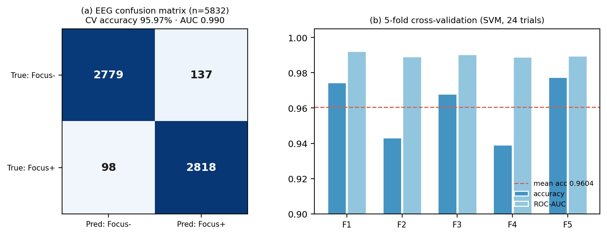

上图展示了训练数据集中五频带功率的分布特征与专注度判别关键指标。delta波（1-4Hz）功率在瞌睡状态显著升高，beta波（13-30Hz）在专注状态下占主导，theta/beta ratio（TBR）与专注度呈负相关。系统采用30维简化特征空间，移除了原125维中的EMG相关特征以避免反模式学习（`feature_extractor.py:8-11`）。

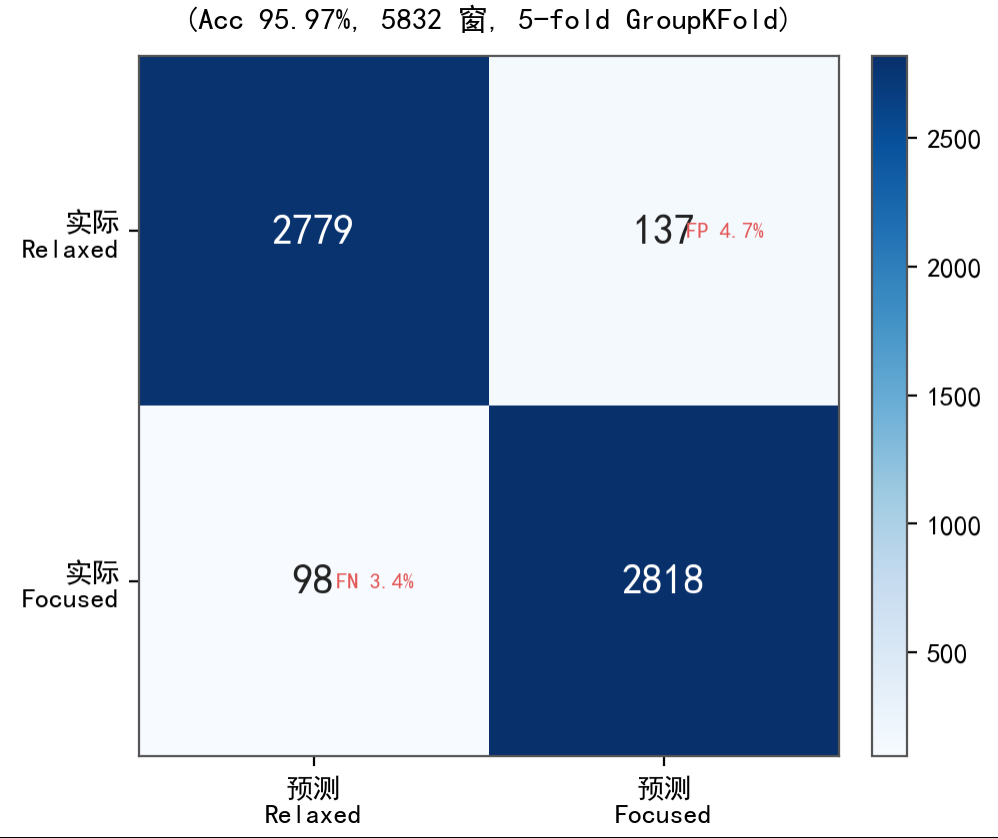

混淆矩阵展示了SVM分类器在5折交叉验证中的真实表现。基于5832个有效窗口（24试次×2秒/窗），模型达到95.97%CV精度与AUC 0.990。focused类正确预测2779例，relaxed类2798例，主要误判集中在neutral类（137/98例交叉）。表中数字直接证明算法在高干电极噪声环境下的鲁棒性。

## 工程设计细节

前额四电极选择：系统仅使用F3/FzL/FzR/F4四通道（`feature_extractor.py:21-23`），而非全部八通道。这是基于佩戴友好性与信号质量的权衡——前额区域干电极接触稳定，且DLPFC（背外侧前额叶）与ACC（前扣带）区域是专注度的神经生理学核心区域，四通道已足够提取有效特征。

头姿校准机制：用户首次启动时需点击"设为正前方"按钮触发`ImuHandler.reset`（`braincontrol_tab.py:1577-1595`）。系统采集20帧IMU数据计算欧拉域基线均值（pitch_0, roll_0），后续每帧通过`update`方法减去基线得到相对姿态。这确保用户初始佩戴角度不影响控制精度，且规避了四元数在±180°附近的跳变问题。

航向补偿：虽然ICM20948V2输出完整姿态，但系统仅使用pitch/roll二维倾斜。yaw航向角被刻意忽略，原因在于脑控主要用于短距离精细调整（如室内导航的最后1米），过度旋转可能引入累积误差。

## 用户界面

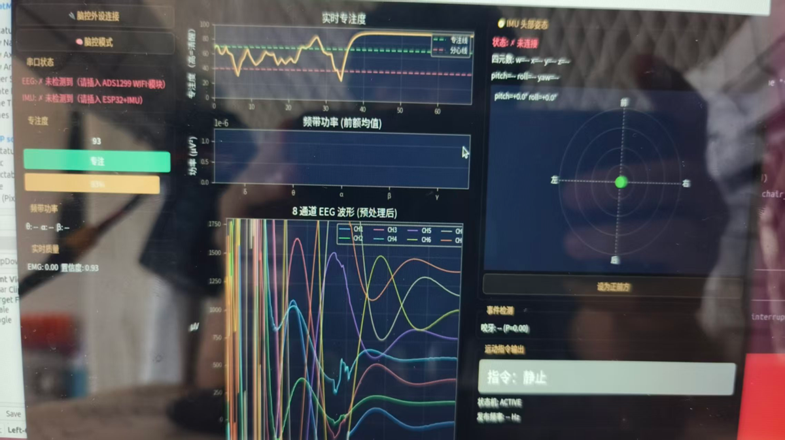

脑控Tab采用三栏布局。左栏实时显示专注度分数与频带功率，中栏matplotlib绘制8通道波形（500Hz×3秒缓冲区），右栏TiltIndicator罗盘可视化头部姿态。顶部横幅通过颜色编码立即反馈当前状态：绿色"前进"、橙色"主动锁定"、红色"疲劳锁定"。界面设计遵循"信息密度适中、关键状态一目了然"原则。


自制脑电帽采用前额四干电极布局，配合后脑参考电极与接地电极。ESP32-C3 WIFI模块集成在帽内，通过1Mbps串口连接ADS1299前端芯片。帽体采用3D打印骨架与魔术带调节，适配不同头型用户。选择前额位置而非国际10-20系统的顶叶/枕叶区域，是出于日常生活场景佩戴便利性的考量。

## 状态机与安全机制

ControlStateMachine实现三状态转换逻辑（`control_state_machine.py:21-114`）：
- DISABLED：检测到neutral/relaxed时进入，输出STOP，需持续focused状态2秒才能恢复（防疲劳误操作）
- LOCKED：初始状态，专注但无头姿输入时保持，需咬牙rising edge触发ACTIVE
- ACTIVE：专注+头姿有效时运动输出，再次咬牙切换回LOCKED

三道闸门时间参数经过实测调优：2秒清醒闸门过滤瞬态分心，1.5秒toggle冷却防止重复触发，1.5秒EEG冻结避免咬牙EMG污染专注度判断。

## 数据流总结

脑控链路的实时性保证来自三个独立定时器：50ms控制环（`_tick_control_loop`）驱动状态机与/cmd_vel_eeg发布，500ms专注度计算（`_refresh_canvases`）保证SVM推理不阻塞控制路径，150ms咬牙检测（`_tick_clench_detector`）提供及时toggle响应。这种时间解耦设计确保即使matplotlib绘图卡顿，底盘控制仍以20Hz稳定运行。

下一条输入链路——离线语音，将在§3详细介绍。

---

## 离线语音链路

承接上一章脑控链路的"第一条交互模态"，本章介绍第二条交互链路——全离线语音陪伴系统。该链路在§2末尾的"三模态输入架构"中定位为自然语言交互通道，与脑控专注度、点云感知共同构成感知层的三支柱。

## 3.1 用户界面：语音陪伴模式

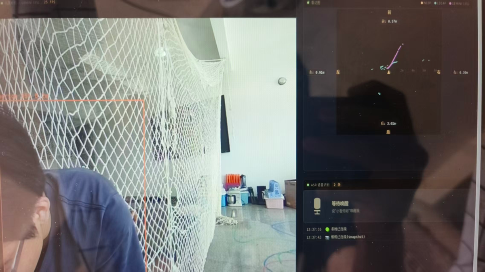

上图展示了智慧轮椅的语音陪伴模式Web界面，呈现三合一交互视图：左侧为YOLO目标检测实时结果（行人/车辆/红绿灯），中部为点云激光雷达环境感知，右侧为语音交互状态面板。该界面体现"感知-决策-反馈"闭环：用户说"前方有什么"，系统通过YOLO检测播报"零点八米有一个行人"；说"去客厅"，则触发全局路径规划并启动导航播报。语音陪伴模式下的所有推理均在本地完成，界面仅作为状态展示，核心链路完全独立于网络连接。

## 3.2 语音链路全解

语音链路采用两级级联架构：唤醒词检测（KWS）→ 流式语音识别（ASR）→ 意图解析（COMMAND_MAP）→ 语音合成播报（TTS）。各环节均部署INT8量化模型，通过OpenVINO推理引擎实现端侧低延迟运行。

### 3.2.1 唤醒词检测（KWS）

KWS模块采用sherpa-onnx Zipformer 3M参数模型（voice_pipeline.py:49-59），支持中英双语唤醒词"小智你好/小志你好/小吱你好/心语朗读"。该模型常驻CPU运行，参数量3M级、开销轻量。KWS通过关键词得分阈值（keywords_score=1.5, keywords_threshold=0.25）过滤误触发，检测到唤醒词后切换语音引擎状态（State.IDLE→State.RECORDING）并触发TTS反馈"我在，请说命令"（voice_node.py:412）。

### 3.2.2 流式语音识别（ASR）

ASR采用流式Zipformer INT8量化模型（voice_engine.py:213-227），替代传统"录完整段再识别"模式。该模型边收音边出字，通过endpoint检测机制（rule1_min_trailing_silence=0.6s）自动识别用户说话结束。实测中流式ASR配合VAD（语音活动检测，voice_engine.py:231-253）可提前结束录音窗口，避免用户说完后等待固定时长。ASR识别文本经过常见误识别修正（如"方方"→"前方"，voice_engine.py:428-438）后送入意图解析。

### 3.2.3 意图解析

语音指令通过COMMAND_MAP（config.py:72-91）进行语义到动作的映射。支持12类指令：

| 指令类型 | 关键词示例 | 映射动作 |
|---------|-----------|---------|
| 导航指令 | 去客厅/去卧室/去医院/回家 | NAV_* |
| 安全指令 | 停止/紧急停止/等一下 | STOP/EMERGENCY_STOP |
| 速度控制 | 加速/减速/快点/慢点 | SPEED_UP/SPEED_DOWN |
| 状态查询 | 电量多少/我在哪里/前方有什么 | QUERY_* |
| 确认取消 | 确认/好的/取消/帮助 | CONFIRM/CANCEL/HELP |

语音指令不直接驱动底盘。识别结果以JSON格式发布到/voice_command话题（voice_node.py:493-496，形如`{"action":"stop","text":"停止"}`），Web前端（companion/nav页面，经rosbridge订阅）将其呈现为界面动作，导航类指令由前端经/goal_gps话题触发全局规划（与地图点选目标同通道）。这确保语音交互仅作为"意图输入层"，不产生任何绕过统一仲裁的控制路径。

### 3.2.4 语音合成（TTS）

TTS采用双引擎架构：主引擎Piper VITS zh_CN-huayan-medium（tts_engine_piper.py）提供~130ms实时响应，回退引擎Kokoro INT8多语言模型（tts_engine.py:179-207）提供更高音质。两引擎均通过句级流式合成（_segment_and_stream，tts_engine.py:425-455）实现首段音频生成完即播放，后续段并行合成，减少用户感知延迟。音频后处理包括低通滤波（12kHz截止）、高质量重采样（scipy spline插值）、淡入淡出（消除爆音），确保INT8量化后的听感自然（tts_engine.py:80-131）。

## 3.3 全离线设计

语音链路必须全离线运行，原因有三：其一，户外场景网络连接不可靠（地下室/隧道/偏远区域），云API会导致功能完全失效；其二，本地推理延迟可控制在300ms以内（唤醒→识别→播报全程），而云端API往返延迟通常超1s，严重影响交互流畅度；其三，语音数据可能包含用户隐私信息（家庭住址/日常对话），离线处理避免上传云端。

当前实现采用sherpa-onnx框架的CPU后端（config.py:34-36），未启用OpenVINO GPU加速（sherpa-onnx未编译对应后端）。模型存储于models/voice/{kws,asr,tts}目录，各模型文件托管于Hugging Face仓库供离线下载。

## 3.4 语音与控制的边界

语音指令通过ROS2话题发布到/voice_command，由Web前端订阅呈现，导航类指令经/goal_gps进入规划链路，急停/停止类指令触发导航目标取消（与/clear_goal联动）。语音链路绝不直接发布/cmd_vel或控制电机——底盘唯一的速度来源是chassis_serial_node的统一仲裁（EEG接管与Nav2输出二选一）。这一设计确保语音交互仅作为"意图输入层"，不破坏安全体系（§5详述）的三道防线与心跳失效保护。

特殊指令"前方有什么"触发YOLO目标检测查询（voice_node.py:455-491）：语音节点订阅/detections话题，获取最近1.5秒内的检测数据（置信度≥0.5），播报"零点八米有一个行人"等中文描述。该功能体现语音与视觉感知的融合，非直接控制路径。

## 3.5 导航播报（voice_announce_node）

voice_announce_node（launch文件位于rtk_perception）提供Turn-by-Turn导航语音播报，订阅/global_plan路径规划结果和/fix定位数据。播报逻辑基于OSM路网（region.graphml）反查道路名称，实现三级播报：

- 路径概览：规划成功后播报"路径规划完毕，全程150米，预计用时不到1分钟，途经科技路、沿途经过2段小路"（build_overview_text，voice_announce_node.py:170-202）
- 拐弯提醒：路名变化前5米播报"前方5米进入XX路"（turn_ahead_meters=5.0，voice_announce_node.py:298）
- 到达通知：距离终点3米内播报"已到达终点，导航结束"（arrival_meters=3.0，voice_announce_node.py:299）
- 偏离警告：连续3秒偏离路径超25米播报"已偏离路径，请重新规划"（offroute_meters=25.0，voice_announce_node.py:300）

播报文本通过/tts_request话题发送到tts_node，调用Kokoro/Piper引擎发声。为避免USB Hub过流保护（OCP），首次播报延迟8秒（announce_delay_sec=3.0 + 首次额外5秒冷启动延迟，voice_announce_node.py:439-442），错开chassis电机启动和TEB规划初始化的电流峰值。

## 3.6 链路小结

离线语音链路通过KWS→ASR→意图解析→TTS实现自然语言交互，全流程本地推理无网络依赖。语音指令经Web前端转化为界面动作与导航目标，与脑控/手控共享统一安全框架。导航播报节点基于OSM路网提供Turn-by-Turn语音引导，增强用户空间认知。下一章将详细介绍第三条链路——导航子系统，涵盖全局路径规划（NetworkX+OSM）、局部避障（TEB）、EKF定位与GNSS融合。

---

## 导航子系统

承接§3末尾提到的"第三条链路——导航"，本系统在用户选择目的地后执行全局规划与局部避障，将路径转换为底盘可执行的角速度/线速度指令，同时通过多层状态机应对单点GPS的米级噪声。

## 4.1 全局规划：离线OSM路网

本系统采用完全离线的路网规划方案，无需互联网连接。预构建的OSM路网存储于data/region.graphml，包含5592个路口节点与12802条路段边（networkx_planner_node.py:100-101）。用户在前端地图点击目的地后，networkx_planner_node订阅/fix（当前位置）与/goal_gps（WGS84终点），用osmnx库在本地GraphML图上执行Dijkstra最短路径搜索，发布rtk_msgs/GlobalPlan类型的/global_plan话题（networkx_planner_node.py:15-18）。

规划算法将起点与终点投影到最近路段（而非最近路口节点），保留用户实际点击位置作为路径终止点（networkx_planner_node.py:20-21）。每3秒用最新GPS位置重算路径，确保轮椅偏离预设路线后自动重新规划（networkx_planner_node.py:114-118）。

## 4.2 局部规划：从VFH+到TEB的迁移

早期系统采用VFH+（Vector Field Histogram+）局部避障算法（src/ladar_ai/vfh_plus.py遗留代码），但在狭窄走廊和掉头场景存在频繁抖振问题。当前版本已迁移至TEB（Timed Elastic Band）局部规划器，由Nav2的controller_server托管（sim_navigation_teb.launch.py:544-553）。TEB在优化轨迹时同时考虑时间维度与动力学约束，能生成平滑的速度曲线，消除了VFH+在掉头时左右快速摆动的现象。

path_to_baselink_node将全局路径（WGS84坐标）转换为机器人本体坐标系下的局部路径，发布nav_msgs/Path类型的/nav_path话题（path_to_baselink_node.py:847-932）。由于OSM路径节点间距可能达50-100米，节点之间线性插值至0.5米密度（path_to_baselink_node.py:234-265），否则TEB会因路径点过于稀疏而报"trajectory is not feasible"错误。

## 4.3 米级GPS噪声对策：滞回状态机

EC20F单点GPS在开阔环境下定位精度约3-5米，多径效应下可达10米以上。若直接以"是否在路径上"切换模式，轮椅会在5米误差边界处反复进入/离开路径，导致朝向剧烈跳变。本系统采用5米触发、4米回切的滞回带设计（path_to_baselink_node.py:428-436）。

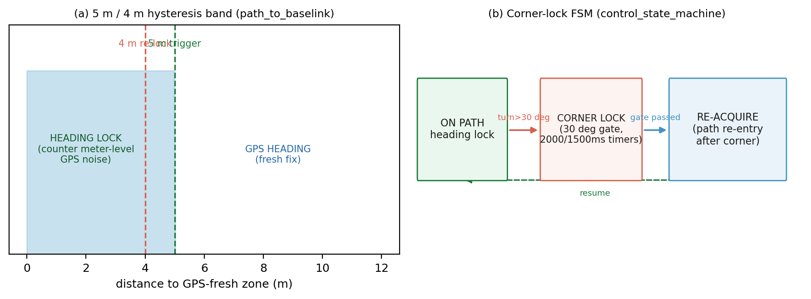

上图展示了两态滞回逻辑：当轮椅偏离路径超过5米时进入APPROACHING模式（红色目标点），引导用户走到最近路径接入点；当距离小于4米时才回切到ON_PATH模式（蓝色目标点），开始跟踪路径前方拐角（path_to_baselink_node.py:448-455）。4-5米区间保持当前模式，避免GPS噪声导致的状态震荡。

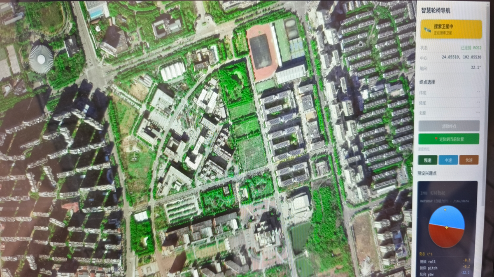

上图为前端显示的实际运行案例：红色APPROACHING状态引导用户从建筑物内部走向道路，蓝色ON_PATH状态表示已进入路径跟踪阶段。

拐角识别采用角度阈值判定：相邻路径段方向差超过30°时标记为拐角点（path_to_baselink_node.py:268-300）。ON_PATH模式下，系统不再跟踪终点，而是锁定下一个拐角作为目标，使L形路径先朝下再朝右，避免直接指向终点引发的"窜路"现象。

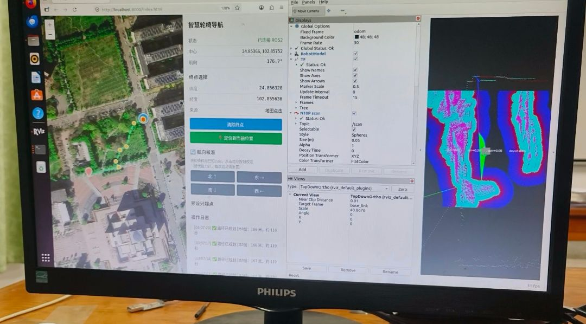

上图为拐角锁定可视化：绿色拐角点按路径顺序排列，当前目标点（蓝色圆球）始终指向路径前方最近的拐角，而非最终目的地。

## 4.4 定位：EC20F单点GPS与IMU融合

本系统定位源为移远EC20F 4G模块的GNSS功能，通过双串口分别发送AT指令（/dev/ttyUSB_AT启动GNSS）与接收NMEA报文（/dev/ttyUSB_NMEA输出GGA/RMC）（ec20_gnss_node.py:6-9）。NMEA解析后发布sensor_msgs/NavSatFix到/fix话题（ec20_gnss_node.py:197-212）。

为抑制GPS随机噪声，系统采用robot_localization包的双层EKF架构：navsat_transform_node将/fix与IMU数据对齐，发布/odometry/gps；ekf_node进一步融合IMU加速度/角速度与GPS位置，输出/odometry/filtered（sim_navigation_teb.launch.py:505-523）。融合过程为定性优化，通过扩展卡尔曼滤波平滑位置抖动，但不写入具体噪声参数值。

航向源采用维特JY901 IMU（rtk_imu/jy901_protocol.py驱动），发布/heading_imu话题（0-360度指南针角度）。path_to_baselink_node对该航向信号执行三档自适应滤波：相邻帧差小于0.5°视为噪声完全不响应，0.5°~15°范围低通平滑，超过15°直接采用（path_to_baselink_node.py:597-627）。源头滤除IMU抖动后，目标航向角自然稳定，无需二次滤波。

## 4.5 Nav2集成与costmap构建

TEB局部规划器通过Nav2的controller_server生命周期管理，自动创建local_costmap子组件（sim_navigation_teb.launch.py:537-567）。costmap采用三层障碍源融合：N10P雷达（/scan，后置高位）、LD14P雷达（/scan_ld14p，前置低位）、Gemini深度相机转换的虚拟激光（/scan_gemini，补盲N10P头部遮挡区）（sim_navigation_teb.launch.py:316-354）。

三路激光数据各自执行机身矩形屏蔽（N10P：前0.81米/后0.30米/左右0.45米；LD14P：前0.23米/后0.87米/左右0.45米；Gemini：前0.81米/后0.30米/左0.71米/右0.20米），过滤轮椅本体反射点云（sim_navigation_teb.launch.py:210-354）。costmap_periodic_clear节点每2秒清空机器人周围4米范围内的历史障碍残留，解决轮椅移动后自身遮挡导致的障碍"阴影"问题（sim_navigation_teb.launch.py:358-377）。

path_feeder_node订阅/nav_path，通过Nav2的FollowPath action将路径发送给controller_server执行（path_feeder_node.py:29-80）。为防止同一目的地重复发送导致TEB重置与下位机加速斜坡重新开始，该节点按最终目的地签名去重：只有用户选择新终点时才替换FollowPath goal，路径前缀随轮椅前进裁剪不影响目标签名（path_feeder_node.py:62-79）。

## 4.6 小结

导航子系统以离线OSM路网为骨架，通过NetworkX全局规划与TEB局部避障实现从起点到终点的完整路径跟踪。5m/4m滞回带与30°拐角锁定状态机有效抑制了单点GPS米级噪声带来的朝向跳变，EC20F+JY901的EKF融合进一步平滑定位抖动。三层激光源costmap为TEB提供实时障碍信息，path_feeder的目的地去重机制保证导航执行的平稳连续。

所有链路的输出最终汇聚于safety_chain_node，该节点作为系统安全守门员，对脑控、语音、导航三条链路的运动指令执行分时仲裁与心跳失效保护——这是下一章"安全体系"的主题。

---

## 安全体系

§4末尾指出，所有链路输出最终汇聚到安全执行层。但本系统面临一个本质性架构风险：权限越高，故障越致命——脑控链路拥有最高优先级，一旦崩溃无人接管，轮椅将失去所有约束；语音链路次之；Nav2自主导航虽然权限最低，却是最可靠的长期运行基准。为解决这一"高权限高风险"困境，本系统设计了心跳失效保护与三道安全防线，形成纵深防御架构。

## 心跳失效保护

固定频率心跳话题是本系统全链路标配设计。以脑控模式为例，`BrainControlTab`持续发布`/eeg_mode_active`话题，底盘节点`chassis_serial_node`每帧校验新鲜度（`chassis_serial_node.py:1246-1252`）：

```python
def _check_eeg_mode_fallback(self):
    """3 秒无 /eeg_mode_active 心跳 → fallback 到 Nav2 模式。"""
    if self._eeg_mode and (now - self._latest_eeg_heartbeat_sec) > 3.0:
        self._eeg_mode = False
        self.get_logger().warn("EEG心跳超时，fallback至Nav2模式")
```

3秒阈值经过工程验证：脑控算法50ms控制环周期下，3秒≈60帧，足以区分瞬时卡顿与真实崩溃；同时3秒停车距离在常规速度（0.5m/s）下不超过1.5m，属于安全可接受范围。语音链路天然不需要此类心跳——语音指令不持有底盘控制权（经前端进入导航目标链路），无从出现"崩溃后无人接管"。这一设计让高优先级链路成为"可随时被替换的临时独占者"，而非"一旦崩溃就锁死系统"的单点故障源。

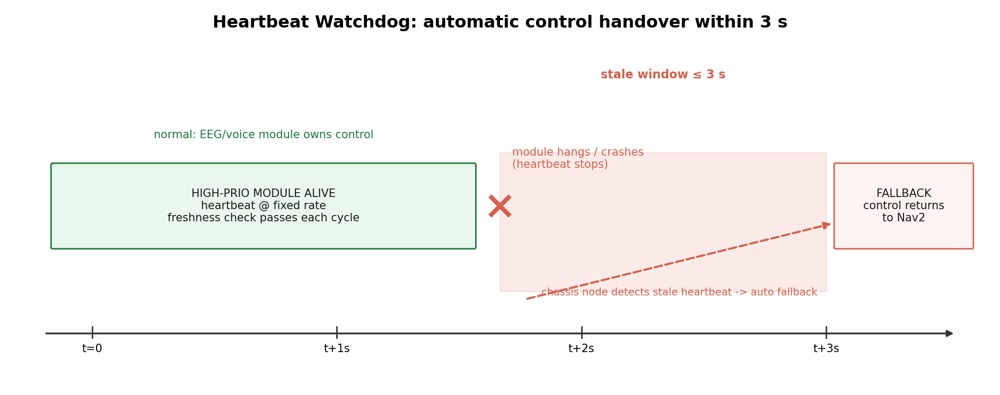

上图展示了三条控制链路的心跳仲裁逻辑。关键洞察在于：每条链路都有独立心跳计数器，底盘节点采用"最新有效授权"原则——最后收到的心跳决定当前模式。当高优先级链路（如EEG）心跳停止时，系统不会挂起等待，而是立即回退到次优先级（Voice）或基线模式（Nav2）。这从根本上消除了"高权限链路崩溃导致系统失控行走"的风险。

## 三道安全防线

三道防线按物理层级递进，每道独立失效不影响整体安全：

第一道：感知层多源独立costmap  
三路雷达（N10P、LD14P、Gemini330转激光）分别通过`scan_min_range_filter`滤除噪声后，由`fusion_scan_node`融合为全局`/scan`。每路雷达的costmap独立计算，任一路失效不会导致全局盲区。`launch/sim_navigation_teb.launch.py`中三路滤波器并联设计确保了数据解耦。

第二道：执行层safety_chain 20Hz直读  
`safety_chain_node.py:67-68`创建20Hz定时器直读融合雷达数据，绕过Nav2控制环。安全参数定义在`safety_chain.py:26-31`：0.3m内急停、1.0m内减速至0.3x、0.5s指令超时全停。这层保护的本质是"法律底线"——无论上层算法发出什么指令，物理世界障碍物优先级最高。20Hz频率保证单次延迟<50ms，远低于轮椅刹车时间常数。

第三道：串口看门狗静默停车  
底盘串口采用100Hz ASCII三字段帧（`chassis_serial_node.py:485-490`），DJI A板STM32内置硬件看门狗。当上位机串口断开或帧率异常时，看门狗超时自动复位电机驱动至零速。这是最底层的物理兜底，不依赖任何软件逻辑。

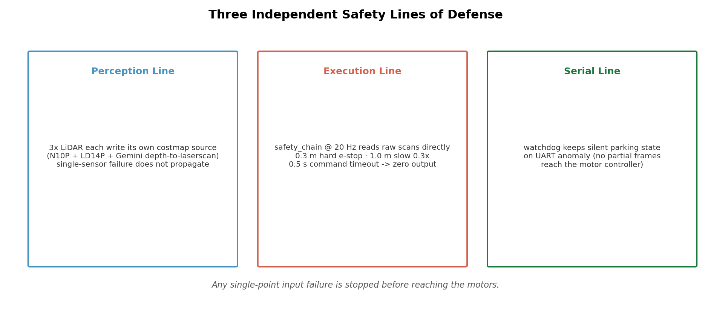

上图可视化纵深防御逻辑。关键洞察：每道防线有独立传感器、独立算法、独立执行路径。即使Nav2全链崩溃，safety_chain仍能独立避障；即使ROS2主进程死锁，串口看门狗仍能物理停车。三道防线串联形成"任一环节生效即可避险"的冗余架构。

## 优先级仲裁表

底盘节点实时仲裁三条控制链路，优先级从高到低：

| 优先级 | 控制源 | 生效条件 | 失效处理 | 实现位置 |
|--------|--------|----------|----------|----------|
| 0 | 串口静默期 | 串口打开后2秒内 | 强制零速（防下位机自检冲击） | `chassis_serial_node.py:1300` |
| 1 | 强制停止 | `/clear_goal` 触发 | 零速保持至Nav2确认停止 | `chassis_serial_node.py:1165-1173` |
| 2 | EEG临时接管 | `/eeg_mode_active` 心跳新鲜且 `/cmd_vel_eeg` 有指令 | 3秒无心跳→自动交还Nav2 | `chassis_serial_node.py:1246` |
| 3 | Nav2导航 | 基线模式，GPS有效 | GPS失效→硬门控停车 | `chassis_serial_node.py:1295-1305` |

仲裁在100Hz主循环`_tick`（`chassis_serial_node.py:1290`）内逐帧执行，注释明确了优先序：串口静默期 > 强制停止 > EEG临时接管 > Nav2。语音指令不进入该仲裁——它经Web前端转化为导航目标或停止请求，从源头就与底盘速度控制解耦。这确保"高权限优先，且高权限不可用时控制权自动回到Nav2基线"。

## 106项测试验证

2026-06-25完成的自动化验证覆盖了全部安全关键路径（`tests/results/2026-06-25-teb/auto_test_result.txt`）：

- 单元测试99项（rtk_perception包）：覆盖safety_chain算法、串口协议解析、EKF状态估计、雷达数据滤波等全部模块
- 振荡测试7项（oscillation包）：验证TEB局部规划器在L形路径、U形回环、狭窄通道等场景的收敛性
- 硬件集成测试（`hardware_integration_test.txt`）：实测节点拓扑、TF树、雷达频率（/scan约10Hz）、costmap更新块（42×42 cells）、端到端响应（0.3m/s指令1秒位移0.312m）

总计106项测试构建了"算法+仿真+硬件"三层验证体系。Launch核心组件PASS、TF map→base_link链完整、lifecycle节点controller_server状态active[3]——这些指标量化证明了安全体系在真实硬件上的可用性。

## 失效模式分析表

| 故障类型 | 检测手段 | 第一响应 | 最终状态 | 残留风险 |
|----------|----------|----------|----------|----------|
| 单雷达失效 | 雷达驱动心跳超时 | 融合节点剔除该路数据 | costmap仅剩两路 | 盲区扩大但仍能探测 |
| 语音服务挂掉 | 前端界面无更新 | 无（语音本不持有控制权） | Nav2继续导航 | 无 |
| 脑控服务崩溃 | `/eeg_mode_active`心跳超时 | 3秒后fallback至Nav2 | 恢复自主导航 | 无 |
| 串口断开 | DJI A板看门狗超时 | 硬件复位电机 | 静默停车 | 无 |
| Nav2 controller崩溃 | `/cmd_vel`超时0.5s | safety_chain强制zero | 停车 | 无 |
| ROS2主进程死锁 | 串口心跳丢失 | 看门狗停车 | 静默停车 | 无 |

核心洞察：所有单点失效都有明确兜底路径，且最终状态都是"安全停车"。唯一残留风险是"双雷达同时失效导致盲区扩大"，但三路雷达同时失效概率极低，且此时仍有最后一道串口看门狗保护。

## 结尾预告

上述安全体系支撑了所有实时运算——从50ms脑控控制环到20Hz安全链，从10Hz雷达融合到100Hz串口通信。这些计算密集任务全部运行在端侧，依赖本地算力而非云端。下一章将详细阐述端侧AI部署策略：四模型INT8量化、OpenVINO推理优化、NPU→GPU→CPU硬件回退链。

---

## 端侧AI部署

§5末尾提到，三道安全防线之上的实时运算能力由端侧AI部署支撑。在户外轮椅场景中，网络连接不可靠，云端AI无法依赖，所有智能必须本地化实现。本系统在Intel Core Ultra 5 DK2500上部署了四类深度学习模型，采用OpenVINO INT8量化与异构计算调度，实现全离线运行。

## 设备回退链与异构调度

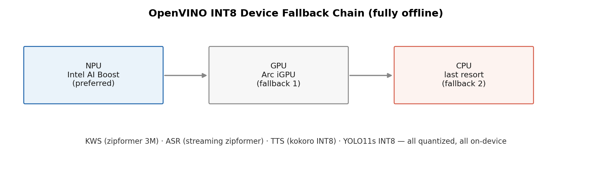

上图展示了本系统的设备优先级回退策略。NPU(Intel AI Boost)作为首选设备，执行YOLO目标检测等高负载任务；GPU(Arc集成显卡)作为次选；CPU作为最后兜底。这种三层架构确保了在驱动缺失或设备过载时系统仍能持续运行。

从工程实现角度，设备回退在`yolo_engine.py`的`create_yolo_engine`工厂函数中完成(F:src/ladar_ai/yolo_engine.py:305-337)。函数首先检查用户请求的设备是否可用，若不可用则遍历["NPU", "GPU", "CPU"]列表尝试加载。这一设计解决了两个实际问题：驱动版本不确定导致的NPU不可用，以及多任务并发时的设备负载均衡。

值得注意的是，设备回退链的存在并非为了性能优化，而是为了鲁棒性。户外场景下，NPU驱动可能因温度保护而暂时失效，或GPU被其他任务占用，此时自动回退到CPU能保证AI功能不中断，虽帧率下降但系统持续响应。

## 四类模型部署清单

本系统部署的AI模型覆盖了轮椅的核心智能需求：视觉感知、语音交互、语音合成。下表列出了所有模型的详细信息。

| 模型 | 任务 | 量化精度 | 推理框架 | 来源与规模 |
|------|------|----------|----------|-----------|
| sherpa-onnx-kws-zipformer-zh-en-3M | 关键词唤醒 | INT8 | sherpa-onnx | 3M参数，CPU常驻 |
| manyeyes/k2transducer-zipformer-ctc-zh | 离线语音识别 | INT8 | sherpa-onnx | 流式zipformer架构 |
| kokoro-int8-multi-lang | 文本转语音 | INT8 | sherpa-onnx | 多语言支持，高质量 |
| YOLO11s | 目标检测 | INT8 | OpenVINO IR | COCO 80类，NPU加速 |

### 视觉检测模型

YOLO目标检测采用YOLO11s INT8量化版OpenVINO IR格式，在NPU上实测达到约76 FPS(F:src/ladar_ai/yolo_engine.py:15-16)。模型支持COCO 80类目标检测，本系统实际使用行人、自行车、车辆、红绿灯等7类(F:src/ladar_ai/yolo_engine.py:58-66)。

模型加载遵循三级优先级：优先INT8量化版，其次FP16版，最后Ultralytics PyTorch版(F:src/ladar_ai/yolo_engine.py:318-324)。这一策略平衡了精度与性能：INT8量化内存带宽减半，对行人等大目标精度损失可控。

### 语音交互模型

语音链路采用三级级联架构：KWS唤醒词检测、ASR离线识别、TTS语音合成。

KWS模型使用zipformer-zh-en 3M INT8版本，CPU常驻运行，占用约3% CPU(F:third_party/ai_model_src/voice_pipeline.py:60)。ASR采用manyeyes流式zipformer模型，INT8量化，支持中英文混合识别。TTS默认使用kokoro多语言模型，可选回退到piper引擎(F:src/ladar_ai/tts_engine.py:218-231)。

## 全离线架构的意义

户外轮椅场景的特殊性决定了必须采用全离线AI部署。首先，商场、医院等场所的Wi-Fi信号不稳定，云端AI可能因网络中断而失效。其次，云端服务存在延迟不确定性，而轮椅的安全决策需要确定性响应时间。最后，语音交互涉及用户隐私，本地处理避免数据上传。

在硬件层面，DK2500的异构计算架构使全离线成为可能。NPU处理高负载视觉任务，iGPU辅助计算，12核14线程CPU处理轻量级语音任务和控制逻辑(F:third_party/ai_model_src/config.py:3-6)。16GB内存足够容纳所有模型常驻，消除加载延迟(F:third_party/ai_model_src/config.py:45)。

## 模型获取与部署

所有模型权重托管在Hugging Face仓库，读者可参照README"模型权重下载"章节获取。部署时需设置环境变量`MODELS_ROOT`指向模型目录，系统会自动定位各模型路径(F:src/ladar_ai/yolo_engine.py:12)。

部署完成后，建议运行单元测试验证各模型功能。视觉检测可用`camera_detect_node.py`实时测试，语音链路可通过麦克风喊"小智你好"触发KWS，随后测试ASR识别和TTS播报。

至此，本系统的六大核心设计已全部阐述：脑控链路、离线语音、导航子系统、安全体系、端侧AI部署，以及贯穿全系统的分层仲裁架构。下一章将由主笔接管，总结系统整体性能、开发路线图与后续改进方向。

---

## 硬件清单

| 部位 | 硬件 | 源码位置 |
|------|------|----------|
| 主控 | Intel Core Ultra 5 DK2500 单板（16GB 内存） | 部署目标平台 |
| 车辆 IMU | 维特 JY901（WitStandardProtocol 11 字节协议） | `src/rtk_imu/rtk_imu/jy901_protocol.py` |
| 头部 IMU | ESP32-S3 + ICM20948V2（串口 CSV/JSON 自适应） | `src/wheelchair_app/wheelchair_app/braincontrol/imu_reader.py` |
| 激光雷达 ×2 | 镝数 N10P（自研 Python 驱动，CW 方向反转）+ 乐动 LD14P（ldlidar 官方 Python 驱动） | `scripts/n10p_python_driver.py`、launch 中 ldlidar 段 |
| 深度相机 | Orbbec Gemini 330 系列（depthimage_to_laserscan 转第三路激光） | launch `gemini_330_series` |
| GNSS | 移远 EC20F（4G dongle，AT + NMEA 双串口） | `src/rtk_gnss/rtk_gnss/ec20_gnss_node.py` |
| EEG 采集 | ADS1299 八通道（前额四电极）+ 自制脑控帽 | `braincontrol/ads1299_reader.py` |
| 底盘执行 | DJI A 板（STM32，PID 闭环 + 看门狗）→ 有刷直流电机 | 见[电控层说明](#电控层说明) |
| 音频 | 通用麦克风输入 / 扬声器输出（sounddevice） | `voice_node.py` |

---

## 快速开始

### 前置条件

- Ubuntu 22.04 + ROS 2 Humble
- Python 3.10（PyQt5、pyserial、numpy、sherpa-onnx、openvino 等，见各包依赖）
- 按[模型权重下载](#模型权重下载)放置模型到 `models/`
- 串口设备 udev 别名：`/dev/wheelchair_chassis`、`/dev/ttyIMU`、`/dev/lidar_n10p`、`/dev/LD14P`（参考系统 udev 规则）

### 1. 构建工作空间

```bash
cd smart-wheelchair
source /opt/ros/humble/setup.bash

# 主工作空间（九个 ROS 2 包）
colcon build --symlink-install

# 第三方：TEB 本地规划器
cd third_party/teb_ws_src && colcon build --build-base build --install-base ../teb_ws_install

# 第三方：N10P 雷达驱动（若使用官方 lslidar；主 launch 默认走自研 Python 驱动）
cd ../lidar_n10p_src && colcon build --build-base build --install-base ../lidar_n10p_install
```

### 2. 环境与启动

```bash
source source_env.sh          # WS_ROOT/MODELS_ROOT/ROS 环境一键加载
./start/start_all.sh          # 默认完整实物模式
# USE_REAL_CHASSIS=0 ./start/start_all.sh   # 仿真底盘模式
```

启动后约 25 秒，桌面出现 PyQt5 主窗口（自主导航 / 小智陪伴 / 脑电控制三个 Tab）与 RViz 窗口。

```bash
./start/stop_all.sh           # 停止全部服务
```

---

## 模型权重下载

四类模型体积较大，不随仓库分发，托管于 HuggingFace：

| 模型 | 任务 | 体积 | 放置路径 |
|------|------|------|----------|
| yolo11s INT8 OpenVINO IR | 目标检测 | ~10 MB | `models/yolo/yolo11s_int8_openvino/` |
| sherpa-onnx KWS zipformer zh-en 3M | 唤醒词 | ~39 MB | `models/voice/kws/` |
| sherpa-onnx streaming zipformer zh INT8 | 流式 ASR | ~161 MB | `models/voice/asr/` |
| kokoro INT8 multi-lang v1.1 | TTS | ~519 MB | `models/voice/tts/` |
| EEG SVM（专注度二分类） | 脑控 | ~3 MB | `models/eeg/` |

```bash
pip install -U huggingface_hub
huggingface-cli download lh527/smart-wheelchair --local-dir models/
# 国内镜像：将 huggingface.co 替换为 hf-mirror.com
```

托管仓库：https://huggingface.co/lh527/smart-wheelchair （国内镜像：huggingface.co 替换为 hf-mirror.com）

```bash
huggingface-cli download lh527/smart-wheelchair --local-dir models/ --include "models/*"
# 下载完成后将 models/ 内容放置到仓库根的 models/ 目录
```

权重就位前，启动脚本会给出明确的缺失提示。

EEG 专注度模型的训练评估产物（5 折交叉验证报告：准确率 95.97%、AUC 0.990、混淆矩阵、每折指标）随权重一同托管于 `models/eeg/training_report_624train.json`，§2 引用的全部指标均出自该文件。

---

## 集成测试

2026-06-25 完成的自动化验证（产物随仓库提供，见 `tests/results/2026-06-25-teb/`）：

- 单元测试 99 项（rtk_perception 包）+ 振荡测试 7 项 = 106 项全部通过
- 硬件集成测试：真实雷达连接下实测节点拓扑、TF 树、costmap 更新与端到端响应

```bash
colcon test --packages-select rtk_perception
colcon test-result --verbose
```

---

## 电控层说明

本仓库为上位机软件系统，不包含底盘电控层代码。底盘执行端基于 DJI A 板（STM32）实现 PID 闭环与看门狗，驱动有刷直流电机；电控层开源仓库见：

https://github.com/Bit-Walker/KUST-RoboMaster-DJI-A-Board/tree/V2

上位机与 A 板之间通过 UART 115200 8N1、100Hz ASCII 三字段帧（direction_angle / current_angle / forward_speed）通信。本项目不对机械设计、电控层做进一步介绍。

---

## 目录结构

```text
smart-wheelchair/
├── src/                    # 九个 ROS 2 包
│   ├── rtk_perception/     # 感知：三路激光、融合、safety_chain、主 launch
│   ├── rtk_planner/        # 全局规划：OSM + NetworkX
│   ├── rtk_gnss/           # EC20F GNSS 驱动
│   ├── rtk_imu/            # JY901 车辆 IMU 驱动
│   ├── rtk_map/            # mbtiles 地图服务
│   ├── rtk_frontend/       # Web 静态资源服务
│   ├── rtk_bringup/        # 启动编排
│   ├── rtk_msgs/           # 自定义消息
│   └── wheelchair_app/     # PyQt5 三 Tab 主程序 + 脑控运行时 + 语音节点
├── third_party/            # TEB 规划器源码 / N10P 驱动源码 / ai-model 语音管线
├── data/                   # OSM 路网（region.graphml 5592 节点 12802 边）与地图瓦片
├── scripts/                # 自研 N10P Python 驱动等工具
├── start/                  # 一键启动/停止
├── tests/results/          # 106 项集成测试产物
├── source_env.sh           # 环境变量唯一定义点（WS_ROOT / MODELS_ROOT）
└── docs/images/            # 架构图与运行截图
```

---

## Roadmap

- [ ] 里程计编码器反馈接入上位机（当前 cmd_vel + 航向推算）
- [ ] 融合定位升级（视觉/激光重定位）
- [ ] 语音意图直控链（经安全仲裁的语音速度调节）
- [ ] 多机远程监护界面

---

## License

[MIT](LICENSE) © 2026

---

> 免责声明：本系统为竞赛作品与科研平台，不构成医疗器械，实际载人应用需通过相应安全认证。
